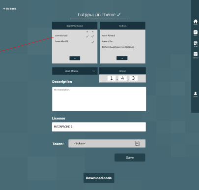

# Pflichtenheft `Projekt-Titel`

## Inhaltsverzeichnis

- [1. Ausgangslage](#1-ausgangslage)
    - [1.1. Ist-Situation](#11-ist-situation)
    - [1.2. Verbesserungspotenziale](#12-verbesserungspotenziale)
- [2. Zielsetzung](#2-zielsetzung)
- [3. Funktionale Anforderungen](#3-funktionale-anforderungen)
    - [3.1. Use Case Überblick](#31-use-case-%C3%BCberblick)
    - [3.2. Use Case A](#32-use-case-a)
        - [3.2.1 GUI Design](#321-gui-design)
        - [3.2.2 Workflow](#322-workflow)
    - [3.3 Use Case B](#33-use-case-b)
        - [3.3.1 GUI Design](#331-gui-design)
        - [3.3.2 Workflow](#332-workflow)
    - [3.4 ...](#34)
- [4. Nicht-funktionale Anforderungen](#4-nicht-funktionale-anforderungen)
    - [`Usability`: Benutzbarkeitsanforderung](#usability-benutzbarkeitsanforderung)
    - [`Efficiency`: Effizienzanforderung](#efficiency-effizienzanforderung)
    - [`Maintenance`: Wartbarkeits- und Portierbarkeitsanforderung](#maintenance-wartbarkeits--und-portierbarkeitsanforderung)
    - [`Security`: Sicherheitsanforderung](#security-sicherheitsanforderung)
    - [`Legal`: Gesetzliche Anforderung](#legal-gesetzliche-anforderung)
- [5. Mengengerüst](#5-mengenger%C3%BCst)
- [6. Systemarchitektur](#6-systemarchitektur)
    - [6.1 Deployment-Diagramm](#61-deployment-diagramm)
    - [6.2 Datenmodell](#62-datenmodell)

## 1. Ausgangslage

### 1.1. Current State

All main-stream calendars use the so-called iCalendar format (or "iCal format" for short) for
storing the calendar information. iCal is standardized, so it is what big companies jump for.

iCal features include:

Basic calendar features (entering tasks, events)

- Todos
- Recurring tasks
- Handling dates and times

### 1.2. Potential for improvement

The standardization of calendar formats is good for consistency reasons but restricts what a
calendar can be drastically. If iCal does not support a feature, it becomes really hard to implement
said feature in the main-stream calendars.

Also, it is virtually impossible to create a modular calendar if you obey by the iCal walls, i.e., a
calendar for which plugins can be created, exchanged, sold, bought, ETC.

## 2. Zielsetzung

### 2.1 Concrete

We want to make a calendar that does not use the iCal format. It should also be modular and easily
expandable. Here is a concrete feature set.

**Basic**

- Appointments, tasks, events, ...
- Recurring Tasks
- Categorization of appointments, tasks, events, ...
- Colorization of appointments, tasks, events, ...
- Copy/paste feature for appointments, tasks, events, ...
- Option for setting first day in a week

**Views**

- Week View
- Views for user-set amount of days, each starting with user-set week day
- Month View
- Year View

**Modules**

- Rust
- Object oriented database
- Different kinds of modules
    - Block module (restricted in domain and space)
    - Background modules (ui manipulation anyway they want to, there's always a way to deactivate
      those)
    - Data modules (add information that is stored in database)
    - Bundles (a set of block, background, or data modules)
- Pre-implemented default modules
    - Statistics module for data visualization (block module)
    - Todo list module (block module)
    - Notes module (block module)

**Website-specific features**

- Login system with Single-Sign-On option
- Feature display
- Main calendar app
- About page
- Documentation on usage for plugin creators

### 2.2 Mind Map

## 3. Funktionale Anforderungen

### 3.1. Use Case Überblick

### 3.2. Accessing Landing Page |Yanni

#### 3.2.1 GUI Design

#### 3.2.2 Workflow

When any user goes to the homepage of NiiC, they are greeted by a friendly walkthrough of our main
features.

This is just a simple, front-end-only slide-show of four slides where the user first learns about
the main idea of NiiC,
then the plugin system, and then how they can create their own plugins.

### 3.3. View Modularity Marketing Page (Showcase) |Yanni

#### 3.3.1 GUI Design

#### 3.3.2 Workflow

The HTML for this page is provided statically from the HTTP server. The page and content itself is
also static and has
no dynamic components. For now, the showcases aren't decided on yet (hence the "Coming soon".) These
will be determined
when the main advantages of the modularity are clear in practice.

### 3.4. View Features Marketing Page (Showcase) |Yanni

#### 3.4.1 GUI Design

#### 3.4.2 Workflow

The HTML for this page is provided statically from the HTTP server. The page and content itself is
also static and has
no dynamic components. For now, the showcases aren't decided on yet (hence the "Coming soon".) These
will be determined
when the most important features are somewhat clear after alpha testing.

### 3.5. View REST and Rust API Documentation Page |Yanni

#### 3.5.1 GUI Design

#### 3.5.2 Workflow

This documentation explains all details needed for creating plugins. The page itself is static.
The navigation on the left and all the content formatting is auto-generated based on a virtual
text hierarchy tree, i.e. headers, subheaders, sections, etc. are entered in an object hierarchy
of text elements and the HTML for the page is mostly generated automatically. Elements such as the
"<-- Go back" button and the menu bar on the right are completely static (and mostly unanimous
across many pages on the site.)

### 3.6 Generate Token for a New Custom Plugin |Yanni

#### 3.6.1 GUI Design

#### 3.6.2 Workflow

As the token is the core of plugin development, this page is very important and has to be intuitive
and quick to use, even more so than other parts of our calendar's UI.

Here, you can select all
relevant information about the plugin (i.e. the kind of plugin and which users are allowed to view
(read) or even edit (write) the plugin's core token information.) If the plugin already exists, you
can choose to, instead of creating a new plugin with a brand-new token, override an old token
with a newly-generated one. This will keep the plugin entry in the database and would only modify
the token, which in terms modifies the kind of plugin and the read-write access specifications.

When "Generate Token" is pressed, the client makes an HTTP request asking for a new token. The
server adds a token entry to the database and responds with the token's unique value. If an error
occurs, the user is prompted.

### 3.7 Use Token and REST API for Adding or Editing a Custom Plugin |Yanni

#### 3.7.2 Workflow

When the user wants to create a plugin, they have to use a publicly available REST api. This API
requires certain metadata about the plugin (e.g. the author and the plugin version.) Additionally,
the programmer must provide the token.

When the server receives the API requests, it qualifies the plugin by its token and metadata. The
server then processes all necessary plugin settings and stores the ui code according to the kind of
plugin, which the token specifies.

### 3.8 Use Rust API to Simplify Access to REST API |Yanni

#### 3.8.2 Workflow

The rust API is a GitHub-based rust crate that programmers can use to abstract the REST api. It
simply provides nice helper functions for making requests and some types that make use of Rust's
powerful type system to do most value checks at compile-time or at least before the requests are
to the server are made.

### 3.9 Publish Custom Plugin to Plugin Store |Yanni

#### 3.9.2 Workflow

Programmers can publish their custom plugins to the plugin store using the REST api. This is the
only public side effect to client-server interactions. The flow of this process follows that of
other REST api requests, see "3.8.2 Workflow".

## 3.10 Read from Plugin DB |Yanni

#### 3.10.2 Workflow

Plugins such as data modules have to store information in a database. This database is not
relational, it's dynamic. Plugins can access their own databases and other plugins' databases in
code using a JavaScript API.

As this feature probably won't be implemented this school year and is not relevant to the current
specification of the project, we will not explain it any further here.

## 3.11. Calendar View Workflow (edit, remove, add, select) |Lawand

### 3.11.1 GUI Design

### 3.11.2 Workflow

When a user engages with our calendar interface, they are able to customize their experience by
selecting from various Views, including daily, monthly, and weekly perspectives. Additionally, users
have the flexibility to create their own personalized Views. Upon choosing to craft a Custom View.
Above that, the user has access to the view which means they can edit or remove it whenever they
want to.

When changing the view, the server will receive an HTTP request to fetch the desired view, and we
will replace it with PUT since views already exist on our server. However, when creating a custom
view, the server anticipates an HTTP command to facilitate the addition of the new user-defined
view.

## 3.12 Task, Events, Appointments Workflow(edit, remove, add, style categorize) |Lawand

### 3.12.1 GUI Design

### 3.12.2 Workflow

When users try creating a task, event, or appointment within our calendar system, the process is
designed to be effortlessly accessible. A mere right-click on the preferred day and time shows an
intuitively crafted window, as showcased above.

This window gives the users the flexibility to make precise selections, including defining the time,
date, category, AET type, and even choosing a specific color for easy visual identification. If you
want to remove the AET all you have to do is to click on the white cross. The mobile view seamlessly
aligns with its desktop counterpart, ensuring a coherent and user-centric experience across
different devices. We get a request with the desired date of the user and the server responds to the
request to load the AET.

## 3.13 Plugins |Lawand

### 3.13.1 GUI Design

### 3.13.2 Workflow

Of course, we give our user the possibility to get his creativity real, which means they have the
freedom to change the Theme or extend our website to better, you can install plugins. There are
plugins that the user can edit and plugins that he can't edit, let us dive deeper into the plugins
that the user is only allowed to view and use.

As you see in the images above, the user can download the code to use the theme and just look at the
details. So there is nothing much the user can do.

Plugins that the user is allowed to edit:

The user has access to the token, can download the code and edit it, and he can choose what kind of
module it is. After editing the code, the user can upload their code.

## 3.14 Login |Clemens

## 3.14.1 GUI Design

## 3.14.2 Workflow

To log in or register, the user is prompted to enter their credentials. We allow various
authentication methods, including Google and Facebook. When a user wants to sign in they just needs
to enter their information and we check the data and let the user continue or send them an error
message, why they cant continue. At sign up, the user sends their data to the server and if no error
occurs the new user has an account. (HTTP Request)

## 3.15 Edit Profile |Clemens

## 3.15.1 GUI Design

## 3.15.2 Workflow

So in these settings the user is able to change data from their account.

Also, the user can delete their account by clicking on the "delete account" link. When the user logs
out, they are redirected to the main landing page occurs.

Then the user can change their username, email, or password. When "Save" is clicked, the server
checks if the changes are valid or not. If not, it responds with an error that is then displayed to
the user.

## 3.16 Edit Notifications Options |Clemens

## 3.16.1 GUI Design

## 3.16.2 Workflow

In the notification options, you can edit the notifications. By clicking on "Save" the client makes
an HTTP request for updating the notifications. Then the server checks if the changes are valid. If
the changes are not valid the user gets notified. We have the two options for the smartphone and the
desktop devices. The short reminder before the task starts, and the option to get notified, e.g.
30 minutes before the task starts. The User can set this timespan to their personal preferences. You
can check to get notified by email as well.

## 3.17 View Language and Region Options

## 3.17.1 GUI Design |Clemens

## 3.17.2 Workflow

In the language and region options, you simply choose the language and the timezone. This happens
with an HTTP request which gets sent when "Save" is clicked. If some kind of error occurs, the user
gets notified.

## 3.18 Edit Shortcuts

## 3.18.1 GUI Design

## 3.18.2 Workflow |Clemens

In the shortcut options, you can edit the shortcuts. By clicking on "Save" the client makes an HTTP
request for updating the current shortcuts. If the server gets no error, like overlapping of
shortcuts, the changes get saved. We have multiple shortcuts. Each of the shortcut has a dropdown
menu to establish a letter which "triggers" the shortcut.

## 3.19 View Plugins Store |Clemens

## 3.19.1 GUI Design

## 3.19.2 Workflow

In the plugin store, you can find all available plugins. The 'Filter' and 'Date' options can specify
the response of the server (HTTP request). The Date dropdown allows you to sort the plugins by their
date of creation (you will find more information at 'Filter Options'.) Then, if you want to download
the plugin we check if you have already installed it or not. If not, we add it to your installed
plugins. If you downloaded it already, you just get notified. Also, you can click on one plugin and
we show the specific data of the plugin.

## 3.20 View Installed Plugins |Clemens

## 3.20.1 GUI Design

## 3.20.2 Workflow

In the installed-plugins site, it is possible to activate/deactivate your installed plugins. If you
set one plugin to active or not active, an HTTP request is sent to alter the setting. The server
checks if the changes are valid. If not the user gets notified about the problem. You also have
the 'Filter' and 'Date' features here. These work the same as in the store.

## 3.21 View Filter Options |Clemens

## 3.21.1 GUI Design

## 3.21.2 Workflow

In the filter options, you can filter for the right plugins. By clicking on "Save," the client makes
an HTTP request for updating the results (plugins.) By that, the server checks if the filter is
valid.
If the changes are not valid the user gets notified.

It is possible to search for authors or a licence. You can also exclude these two points. You can
search for specific plugins as well, like data module for example.

## 4. Nicht-funktionale Anforderungen

### `Usability`: Benutzbarkeitsanforderung

- Nothing is required (idk)

### `Efficiency`: Effizienzanforderung

- No effeciency requirements

### `Maintenance`: Wartbarkeits- und Portierbarkeitsanforderung
- The mobile design is missing but it will be soon available for all devices
- A lot of features are missing, so stay updated to see what is coming.
### `Security`: Sicherheitsanforderung

- Our system is highly secure, when it comes to our users privacy.
  But make sure that you do not forget your password.In case of a system breakdown
  nothing much can happen, as pretty much everything is saved in our database.

### `Legal`: Gesetzliche Anforderung
- No legal arrangements required

## 5. Mengengerüst

Zur Abschätzung der aufkommenden Datenmengen und damit verbunden der notwendigen Infrastruktur, um
die nötige Performance zu erzielen, ist ein Mengengerüst zu erstellen. Mögliche Fragestellungen:

- How many users are we expecting?
- We are counting with up to 5,000 users for now, 
  though we are constantly trying to develop
  with guard rails in place for unexpected growth
- how many Daten per users are we awaiting?
  For now, we do not have a good system in place for measuring data consumption.
  Next year, we will be thinking more about performance as we switch to ASP.NET.
- With which inquiry-frequenz are we calculating?
- Answering this requires extensive research. This too will be delved into in more details next year. 
  For now, we are trying to get a good feature set up and running,
  more or less as a prove of concept.

## 6. Systemarchitektur

### 6.1 Deployment-Diagramm

- Auflistung der Softwarekomponenten in einem Verteilungsdiagramm (typisch: Client - Server -
  Datenbank).
- Beispiel:

### 6.2 Datenmodell

- Relational database
